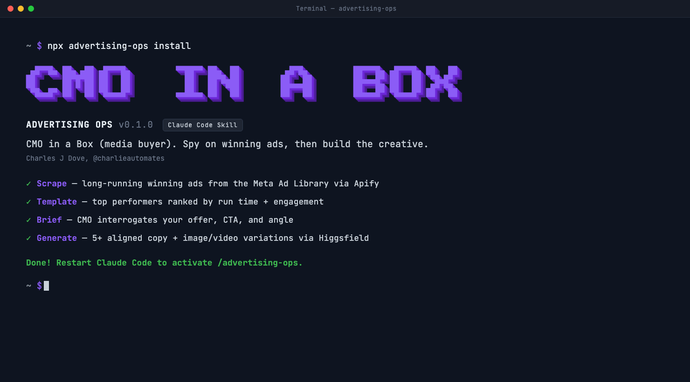

<p align="center">
  
</p>

# Advertising Ops

> **CMO in a Box (media buyer)** for [Claude Code](https://claude.ai/code). Scrapes long-running winning ads from the Meta Ad Library, tears down the video creative frame by frame, then acts as your CMO to generate aligned ad copy and image/video variations ready to launch.

<p>
  <a href="https://www.charlieautomates.com/charlie-os-vs/"></a>
  <a href="https://www.npmjs.com/package/advertising-ops"></a>
  <a href="https://www.npmjs.com/package/advertising-ops"></a>
  <a href="LICENSE"></a>
  <a href="https://github.com/charlesdove977/advertising-ops/stargazers"></a>
</p>

Advertising Ops ships the **`advertising-ops`** skill: a single command that runs the whole loop a media buyer runs by hand. It scopes your business, pulls the ads that have been running long enough to be *proven* winners, ranks them, audits the video creative, then briefs you like a CMO and generates new copy + creative into ready-to-launch folders.

Built for founders, agency operators, and media buyers who want to template what already works instead of guessing at a blank ad account.

---

## Why

Most ad creative fails because it was made in a vacuum. No swipe file, no proof, no teardown of why the competition's ad has been running for six months straight. You launch, you burn budget, you learn nothing.

Advertising Ops fixes that by acting like a CMO across the whole pipeline:

- **Finds proven winners, not noise.** It filters the Meta Ad Library to ads that started months ago AND are still active. Longevity + still-live = the market already validated it.
- **Actually watches the video.** For video ads it downloads the creative, extracts frames with ffmpeg, transcribes the voiceover, and tears down the hook, structure, and CTA — because an ad's persuasion lives in the first three seconds and the script, not the thumbnail.
- **Interrogates your offer.** Before generating anything it pins down one CTA and the exact outcome you sell. Vague offers get pushed back on.
- **Generates aligned creative.** 5+ variations where the copy and the image/video reinforce each other, each dropped into its own folder ready to upload.

---

## How it works

One command, five phases:

1. **Scope** — reads your brand kit if you have one, else interviews you (business, keywords, ICP).
2. **Scrape** — pulls long-running winning ads from the Meta Ad Library via Apify (the `brilliant_gum/facebook-ads-library-scraper` actor), filtered to a minimum run time you set (2 months floor) and still active.
3. **Teardown** — for video ads, downloads each MP4, extracts frames + transcript with ffmpeg, and reviews hook / structure / script / CTA.
4. **Brief** — runs a CMO conversation on ad type, the single CTA, and the exact offer.
5. **Generate** — produces 5+ aligned copy + image/video variations via Higgsfield, each in its own creative folder.

---

## Install

### Option 1 — `npx` (recommended)

```bash
npx advertising-ops install
```

Installs the skill to `~/.claude/skills/advertising-ops/`. Run again with `update` after a package upgrade:

```bash
npm view advertising-ops version          # check the latest published version
npx advertising-ops@latest update         # refresh in place
```

### Option 2 — Global install

```bash
npm install -g advertising-ops
advertising-ops install
```

After global install, the `advertising-ops` command is on your `$PATH` and runs without `npx`.

### Option 3 — Install directly from GitHub

```bash
npx github:charlesdove977/advertising-ops install
npx github:charlesdove977/advertising-ops install --with-commands
```

### Project-scoped install (per repo)

```bash
cd ~/path/to/project
npx advertising-ops install --project
```

### Install a slash command stub

The `/advertising-ops` command is exposed by the skill itself. To also drop an explicit command stub in `~/.claude/commands/`, add `--with-commands`:

```bash
npx advertising-ops install --with-commands
```

### Uninstall

```bash
npx advertising-ops uninstall
npx advertising-ops uninstall --with-commands
```

### Where does it install?

```bash
npx advertising-ops where           # ~/.claude/skills/advertising-ops
npx advertising-ops where --project # ./.claude/skills/advertising-ops
```

---

## CLI reference

```
advertising-ops <command> [flags]

Commands:
  install         Install the advertising-ops skill
  update          Reinstall (overwrites existing)
  uninstall       Remove the skill
  where           Print the install path
  --help, -h      Show help
  --version, -v   Show version

Flags:
  --project           Use ./.claude/ instead of ~/.claude/
  --with-commands     Also install a slash command stub
  --update, --force   Overwrite an existing install (implied by `update`)
```

---

## Requirements

The skill drives three things at runtime inside Claude Code:

- **Apify MCP** ([`@apify/actors-mcp-server`](https://github.com/apify/actors-mcp-server)) — for the ad scrape. Register it as a stdio MCP (`npx -y @apify/actors-mcp-server`) and paste your [Apify API token](https://console.apify.com/settings/integrations). The skill walks you through it.
- **Higgsfield MCP** — for image/video generation. The skill links you to setup if it is not connected:
  - Install: https://higgsfield.ai/s/higgsfield-mcp-v3-earning-series-charlieautomates-ptQTLe
  - Setup video: https://www.youtube.com/watch?v=SY8kQ6qe4YQ
- **ffmpeg** — only needed when auditing **video** ads (frame extraction + audio). Install with `brew install ffmpeg` (macOS) or your package manager.

---

## Usage

Once installed, run it inside an active Claude Code session:

```
/advertising-ops
```

It runs end to end and stops for you at every decision: the keywords to search, how long an ad must have run to count (minimum two months), image vs. video, how many ads (10 / 15 / 20 / 25 / 30), the CMO brief, creative size (1:1, 4:5, or video), and how many variations.

### What you get out

- A **research report** markdown: a winners table sorted shortest-running to longest, the pulled ad copy, video teardowns (if applicable), the CMO brief, and 5+ copy/prompt variations at the bottom.
- A **creative folder per variation**, each with a generated image or video and a `copy.md` holding its aligned text copy.

---

## What gets installed

```
~/.claude/skills/advertising-ops/
├── SKILL.md
├── tasks/
│   └── run-pipeline.md          ← the full sequential pipeline
├── frameworks/
│   ├── apify-ad-scraping.md     ← actor config + the "running 2+ months" filter recipe
│   ├── video-ad-analysis.md     ← download + ffmpeg frames + transcript teardown
│   ├── cmo-brief.md             ← offer / CTA / angle interrogation
│   └── creative-generation.md   ← Higgsfield + copy-to-creative alignment
├── templates/
│   ├── ad-research-report.md    ← the master report
│   └── variation-folder.md      ← per-variation creative + copy
└── context/
    └── brand-scope.md           ← captured business / keywords / ICP
```

Reports and creatives are written to your *project*, not into the skill folder.

---

## The "running 2+ months" filter

This is the core trick. To isolate proven winners, the skill combines two filters on the Meta Ad Library actor:

- `endDate` = today minus your run-time floor (the ad **started on or before** that date)
- `adActiveStatus` = `ACTIVE` (still running right now)

Started long ago **and** still live = it has been running at least that long, and the advertiser is still paying for it. An ad that started 90 days ago but died at day 10 is a loser; the status filter screens it out.

```json
{
  "searchTerms": ["your niche or competitor"],
  "countries": ["US"],
  "adActiveStatus": "ACTIVE",
  "endDate": "YYYY-MM-DD",
  "maxAds": 50,
  "resolveSnapshotUrls": true
}
```

---

## How it watches a video ad

An LLM cannot watch a video. Advertising Ops samples it instead:

1. Download the MP4 from the ad's CDN URL (`curl`, with `yt-dlp` fallback).
2. `ffmpeg` extracts scene-change frames plus a dense first-2-seconds hook burst.
3. `ffmpeg` extracts the audio; it gets transcribed for the spoken script.
4. Claude reads the frames as images and the transcript as text, then writes a teardown: hook, structure, on-screen text, script, CTA.

Higgsfield's `video_analysis` / `virality_predictor` MCP tools are supported as a faster model-driven alternative, but frame extraction is the precise default.

> **Image ads** are simpler: the Apify run returns the image's CDN URL (not the file), so the skill downloads it with `curl` and reads it directly — no ffmpeg. Either way, the scrape returns URLs and metadata; the skill downloads the actual creative when it needs to *see* it.

---

## Why a skill, not a library

The actual work — judging whether an offer is sharp, tearing down why an ad converts, writing copy that matches a generated image — is conversational. A library would just be templates. Claude is the CMO; this package gives Claude the playbook and the install path. The `advertising-ops` CLI exists only to put the files in the right directory.

---

## FAQ

**Does it buy or run ads?**
No. It builds the research and the creative assets. You upload and run them.

**Do I need ffmpeg?**
Only for video-ad audits. Image-ad runs never touch it.

**Does it touch my repo when I install?**
No. The default writes to `~/.claude/skills/advertising-ops/`. Only `--project` writes into the current directory.

**Can I customize the skill after installing?**
Yes, the installed files are yours. The next `update` overwrites them, so fork the repo if you are making meaningful changes.

---

## Related projects

- **[Charlie OS](https://www.charlieautomates.com/charlie-os/)** — one-click Claude Code setup that bundles BASE, CARL, PAUL, SEED, Skillsmith, and a curated skill library. Install it if you want Advertising Ops *plus* the rest of the stack on day one.
- **[Work with Charlie](https://www.charlieautomates.com/charlie-os-vs/)** — done-for-you install, custom skill builds, and 1:1 Claude Code engineering.
- **[procedure-ops](https://github.com/charlesdove977/procedure-ops)** — COO in a box: build ironclad SOPs from interviews, recordings, or drafts.

---

## Contributing

Issues + PRs welcome at [github.com/charlesdove977/advertising-ops](https://github.com/charlesdove977/advertising-ops).

1. Fork + clone
2. Edit files under `skill/`
3. Smoke test with `npx . install --project` inside a scratch directory
4. PR against `main`

When the package version bumps, the skill version inside `skill/SKILL.md` should match.

---

## License

MIT — see [LICENSE](LICENSE).
